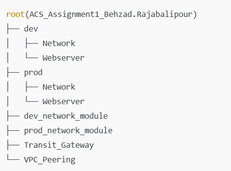

# Setup Requirements and Environment Preparation

## 1. Installing WSL (Windows Subsystem for Linux) via PowerShell
Using WSL makes it easier to work in Ubuntu/Debian-based systems.
1. Open the command terminal in VSCode:
    - A. Install WSL: `wsl --install`.
    - B. List available distributions: `wsl --list --online`.
    - C. Restart your computer.

## 2. Installing Terraform on Ubuntu
1. Open the command terminal in VSCode.
2. Enter `wsl` to connect to your Ubuntu/Debian-based distribution.
3. Update the package list: `sudo apt-get update`.
4. Install the unzip application: `sudo apt-get install unzip -y`.
5. Download the latest version of Terraform: `wget https://releases.hashicorp.com/terraform/1.5.0/terraform_1.5.0_linux_amd64.zip`.
6. Unzip the Terraform package: `unzip terraform_1.5.0_linux_amd64.zip`.
7. Move the Terraform binary to the bin directory: `sudo mv terraform /usr/local/bin/`.
8. Verify the installation: `terraform --version`.

## 3. Setting Up AWS CLI in VSCode
1. Open the command terminal in VSCode.
2. Enter `wsl` to access your Ubuntu/Debian-based distribution.
3. Download the AWS CLI installer and rename it: `curl "https://awscli.amazonaws.com/awscli-exe-linux-x86_64.zip" -o "awscliv2.zip"`.
4. Unzip the AWS installer: `unzip awscliv2.zip`.
5. Run the installer with elevated permissions: `sudo ./aws/install`.
6. Verify the installation: `aws --version`.

## 4. Connecting to AWS CLI via VSCode
1. Open the command terminal in VSCode.
2. Enter `wsl` to access your Ubuntu/Debian-based distribution.
3. Create the credentials file: `vi ~/.aws/credentials`.
4. Copy your AWS credentials (`aws_access_key_id`, `aws_secret_access_key`, `aws_session_token`) into `~/.aws/credentials`:
    - A. Type `gg` to go to the beginning of the file.
    - B. Then type `dG` to delete everything from the cursor to the end of the file.
    - C. Paste your credentials.
5. Check your AWS CLI connection: `aws sts get-caller-identity`.

# Infrastructure Deployment Steps
### Infrastructure Tree

### 1. Create S3 Buckets:
1. Open the command terminal in VSCode.
2. Enter `wsl` to access your Ubuntu/Debian-based distribution.
3. Create the development S3 bucket: `aws s3api create-bucket --bucket dev-behzad-bucket`.
4. Create the production S3 bucket: `aws s3api create-bucket --bucket prod-behzad-bucket`.

### 2. Deploy Development Environment:
1. Keep the VSCode terminal open.
2. Navigate to the Network directory: `cd ./dev/Network/`.
3. Initialize Terraform: `terraform init`.
4. Create an alias for Terraform: `alias tf=terraform`.
5. Deploy the development network infrastructure: `tf apply -auto-approve`.
6. Move to the Webserver directory: `cd ../Webserver/`.
7. Generate the development SSH key: `ssh-keygen -t rsa -f ~/.ssh/devKey`.
8. Set the SSH key permissions to read-only: `chmod 400 ~/.ssh/devKey`.
9. Re-initialize Terraform: `tf init`.
10. Deploy the development web server infrastructure: `tf apply -auto-approve`.

### 3. Deploy Production Environment:
1. Keep the VSCode terminal open.
2. Navigate to the production Network directory: `cd ../../prod/Network/`.
3. Initialize Terraform: `tf init`.
4. Deploy the production network infrastructure: `tf apply -auto-approve`.
5. Move to the Webservers directory: `cd ../Webservers/`.
6. Generate the production SSH key: `ssh-keygen -t rsa -f ~/.ssh/prodKey`.
7. Set the SSH key permissions to read-only: `chmod 400 ~/.ssh/prodKey`.
8. Re-initialize Terraform: `tf init`.
9. Deploy the production web server infrastructure: `tf apply -auto-approve`.

### Extra: 4. Deploy VPC Peering:
1. Keep the VSCode terminal open.
2. Navigate to the VPC-peering directory: `cd ../../VPC-peering/`.
3. Initialize Terraform: `tf init`.
4. Deploy VPC peering between the two VPCs: `tf apply -auto-approve`.

### Extra: 5. Deploy Transit Gateway:
1. Keep the VSCode terminal open.
2. Navigate to the Transit-Gateway directory: `cd ../Transit-Gateway/`.
3. Initialize Terraform: `tf init`.
4. Deploy the Transit Gateway: `tf apply -auto-approve`.
